# Nom de l'exposition: 
## Explore

# Lieu: 
## Centre des sciences Montréal
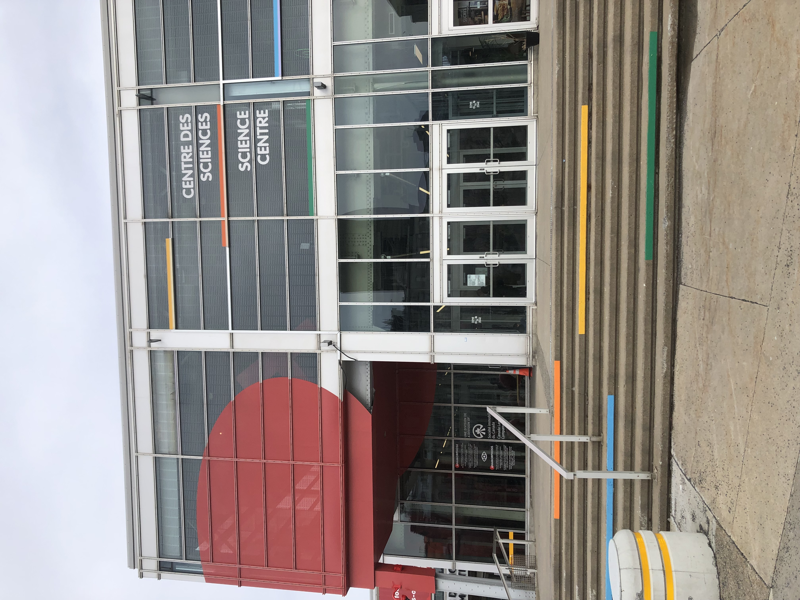

# Type d'exposition: 
## Permanente, intérieur
# Date de visite: 
## 1er avril 2026
# Titre de l'oeuvre: 
## Peux-tu entrainer une voiture à conduire toute seule?
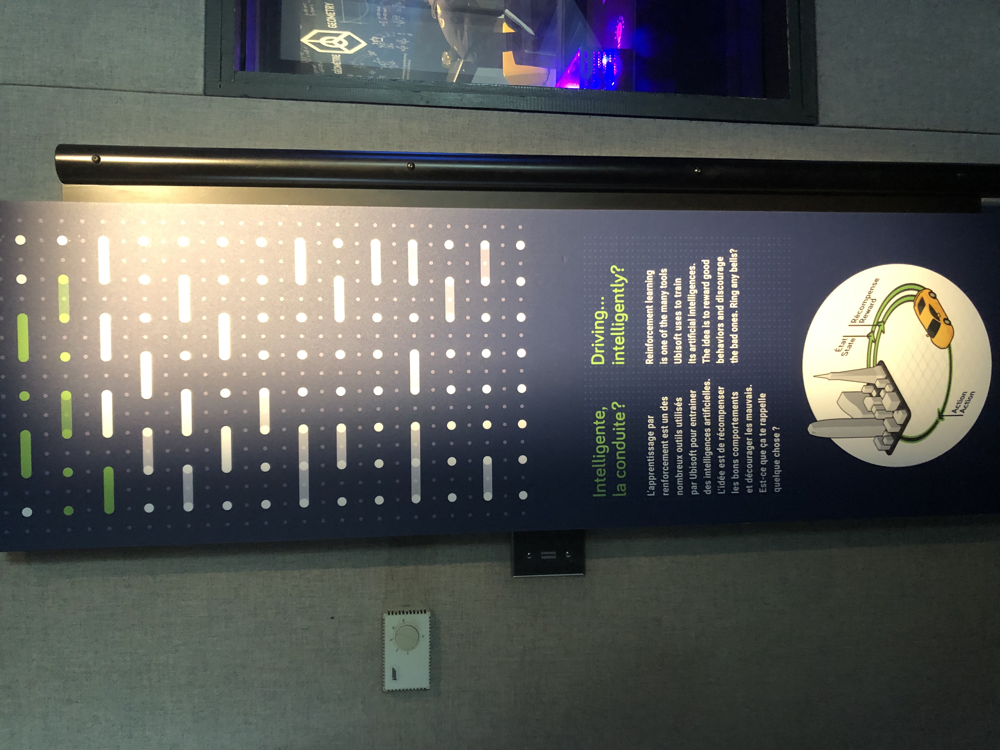

# Nom des artistes: 
- Elisabeth Doyon
- Adrien Logut
- Andrea Feder
- L'équipe de Watch_Dogs 2
- Ubisoft La Forge
- Ubisoft Groupe Technologie
  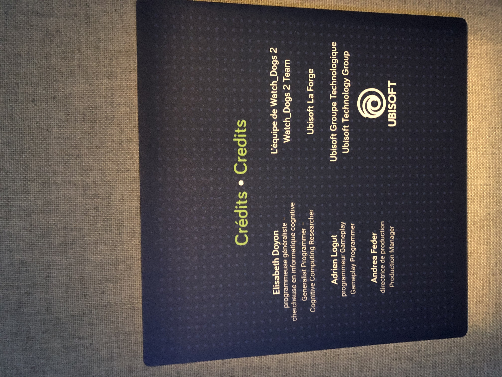
  
# Année de réalisation: 
## 2026
# Description de l'oeuvre: 
## C'est un programme où il y a un écran placé au centre de la salle pour que les visiteurs puissent intéragir avec. Les visiteurs vont être encouragés de choisir entre plusieurs choix disponibles pour décider comment l'IA devrait conduire la voiture comme par exemple: le style de conduite, la détection des obstacles, la durée de l'entrainement, comment le véhicule va freiner et la couleur de la voiture. Ensuite, le programme va générer une vidéo de la conduite de la voiture. Finalement, il va y avoir un résultat qui jugera la qualité de conduite avec par exemple: une conduite parfaite, un danger publique, une tortue stationnée, etc.
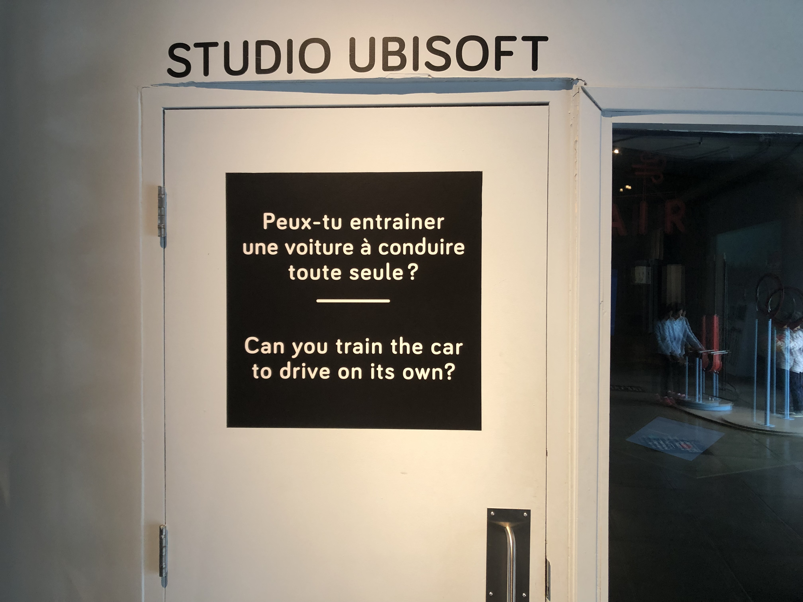
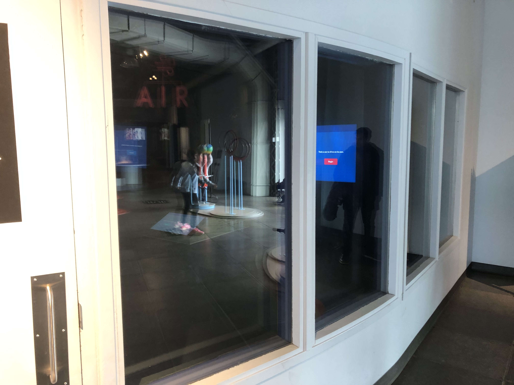
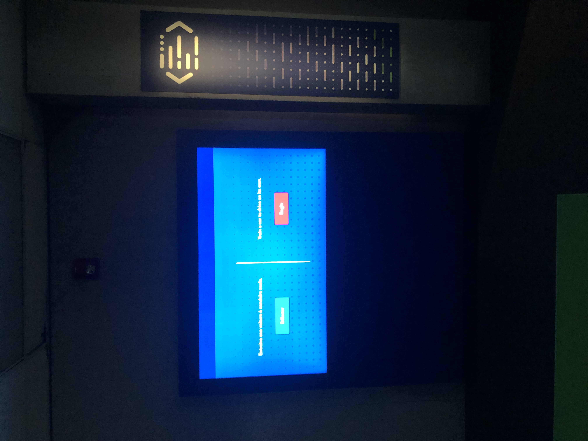

# Type d'installation: 
## Interractive
# Fonction du dispositif multimédia: 
## Support pédagogique
# Mise en espace:
# Composantes et techniques: 
- Écran qui peut être intéragit avec
- Télévision
- 3 Caméras de lumière
- Le code de l'expérience
- Projecteur
  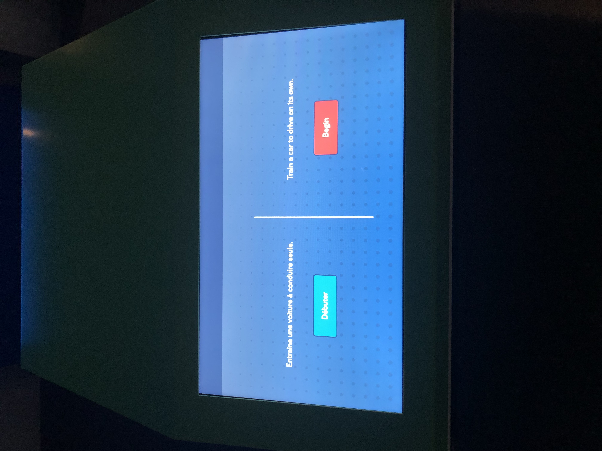
  
  
# Éléments nécessaires: 
- Source d'électricité
- Télevision
- Écran qui peut être intéragit avec
- Le code de l'expérience
- Salle isolée des autres expériences
- Projecteur
  
  
  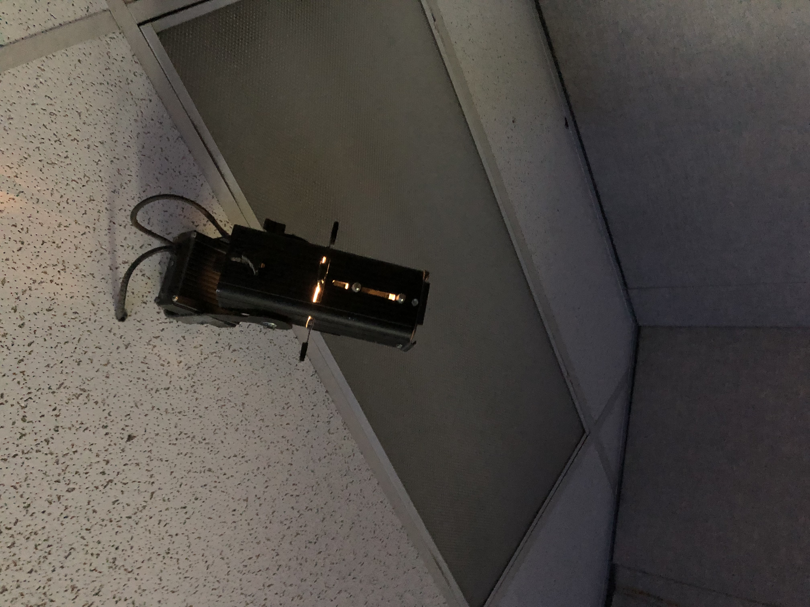
  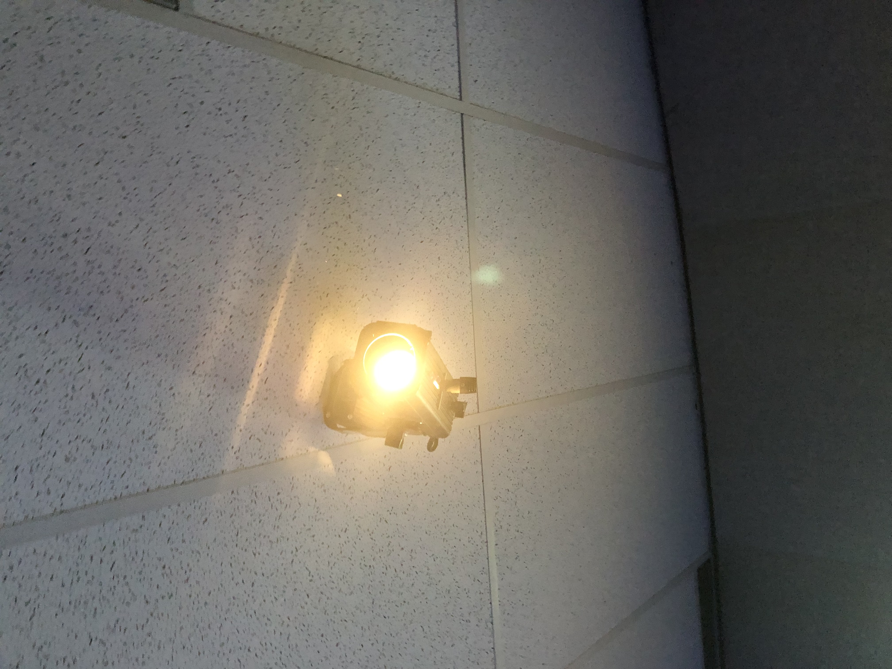
  
# Expérience vécue:
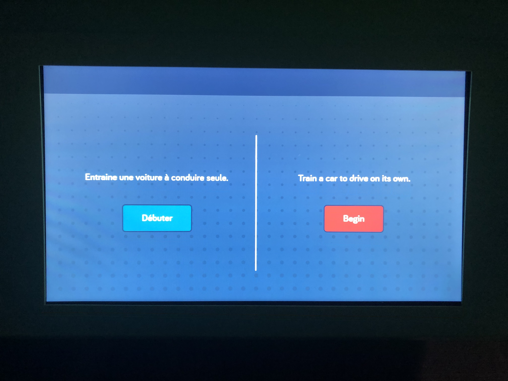
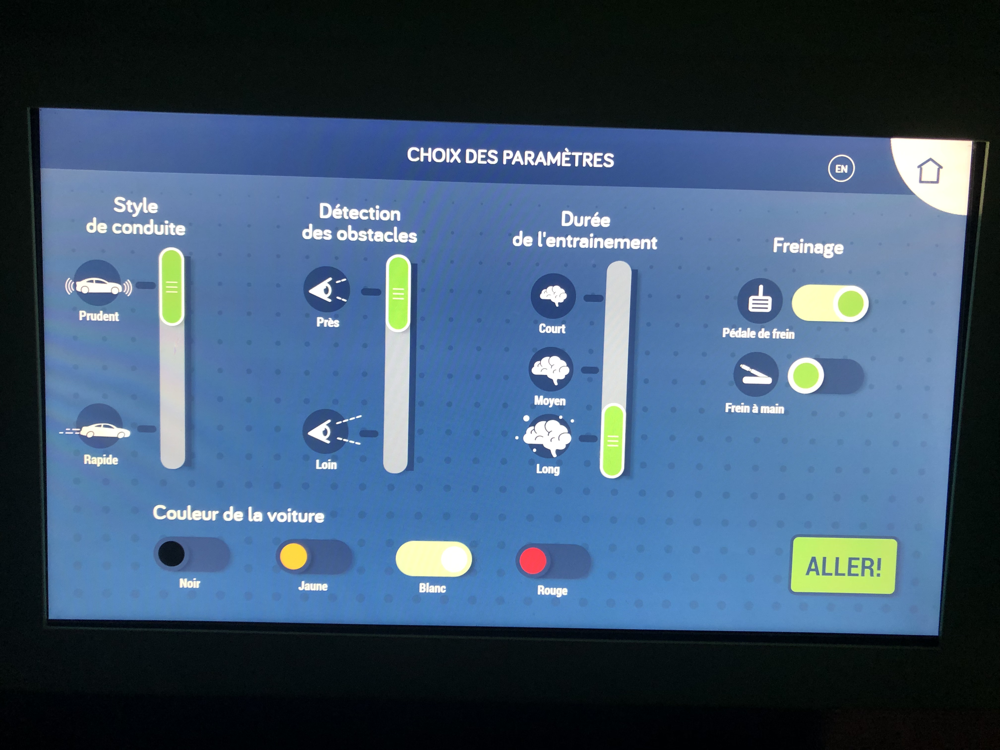
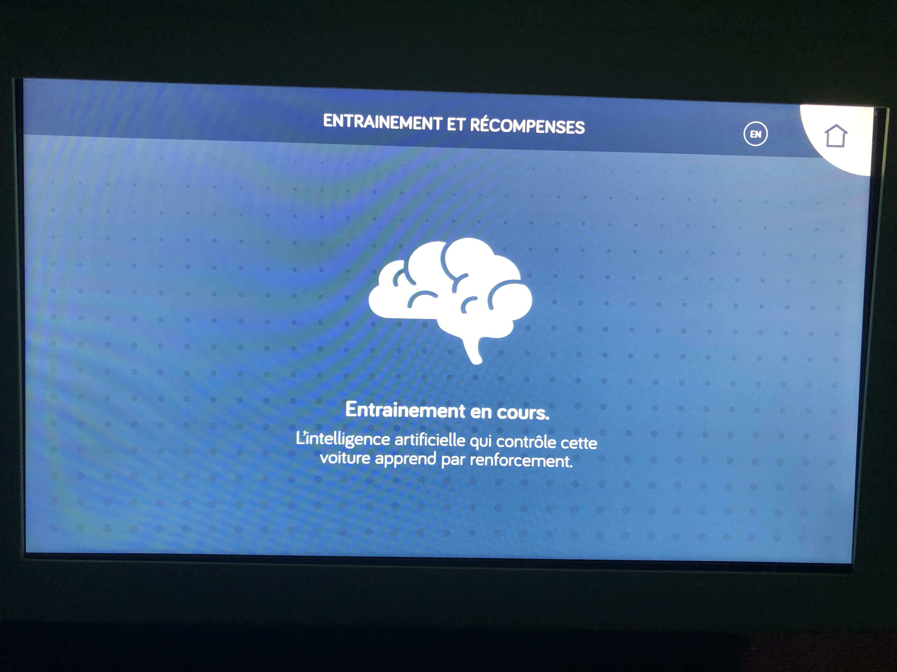

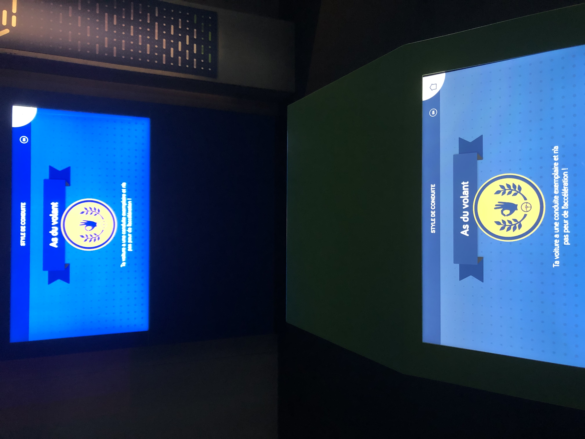

# Ce qui m'a plu: 
## Premièrement, 
# Aspects à ne pas retenir: 
## Mon critère serait que l'oeuvre devient un peu répétitif parce qu'elle n'a pas beaucoup d'options. Avec des options limitées pour le programme, l'intérêt du visiteur tombe pour essayer d'expériencer le reste de l'oeuvre. Sinon, je n'ai pas vraiment d'aspects que je ne voudrais pas retenir de cette oeuvre.
# Références:
- https://www.centredessciencesdemontreal.com/exposition-permanente/explore
- Les photos ont étés prisent par Francis Parent

