# Nom de l'exposition: 
## Montréal
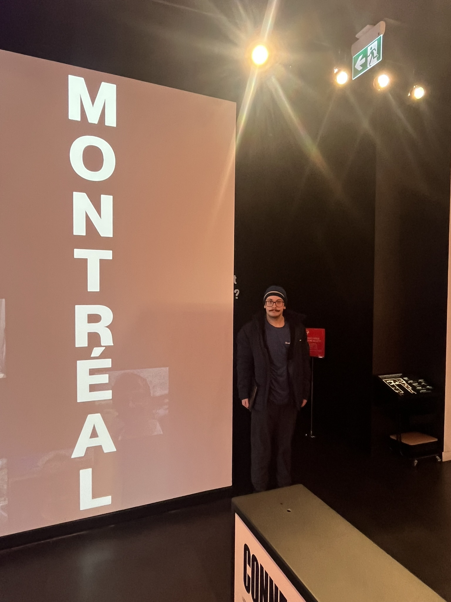
> Moi à côté de l'affiche Montréal prise par Martin Parent (19 février 2026)
# Lieu: 
## MEM - Centre des mémoires montréalaises
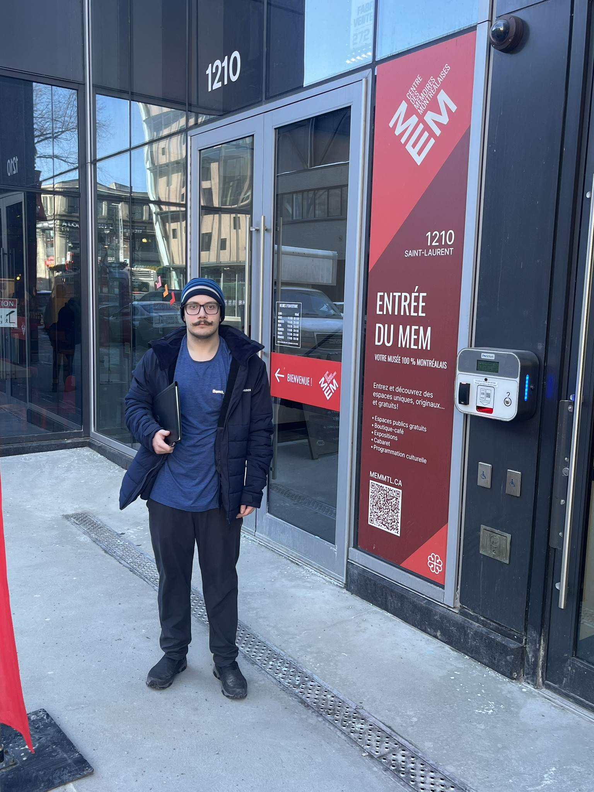
> Moi en avant de l'édifice MEM prise par Martin Parent (19 février 2026)
# Type d'exposition: 
## Permanente de juillet 2024 au janvier 2030, itinéaire, intérieure
# Date de visite: 
## 19 février 2026
# Titre de l'oeuvre: 
## La machine à voyager dans le temps
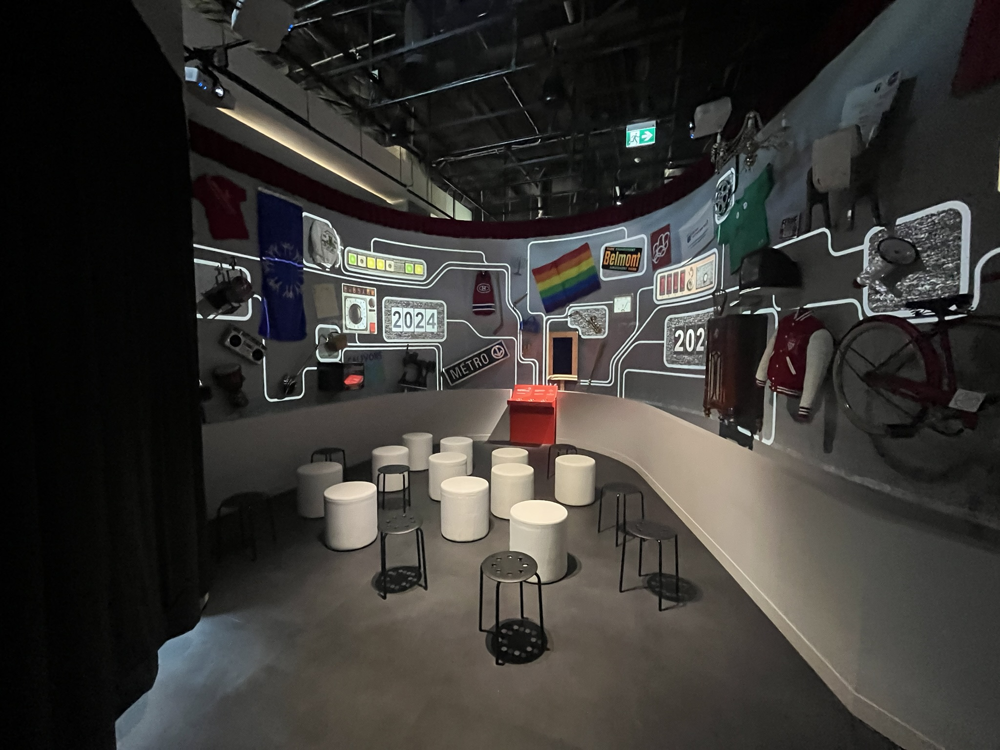 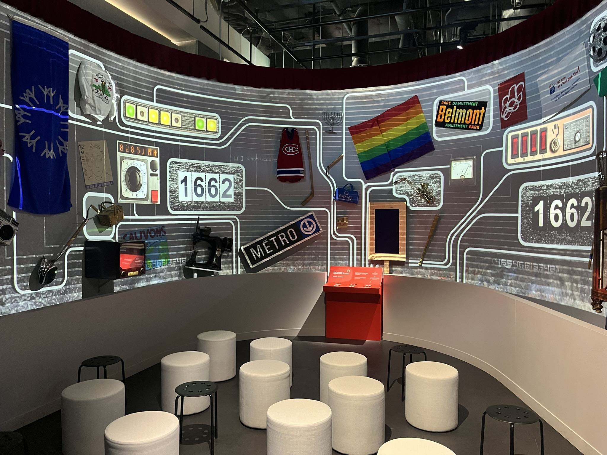
> Vue de la salle de l'expérience prisent par Martin Parent (19 février 2026)
# Nom des artistes: 
## MEM - Centre des mémoires montréalaises et plusieurs volontaires
# Année de réalisation: 
## 2024
# Description de l'oeuvre: 
## C'est un mur courbe avec plusieurs projecteurs qui affichent des vidéos sur l'Exposition Universelle de Montréal (ou Expo 67) le 27 avril 1967. Il y a aussi plusieurs objets attachés sur le mur qui sont historiques pour l'époque de cet évènement. L'exposition décrit l'évènement où, sur une île artificielle, 62 pays ont participés à créer des sections culturelles sur une île pour faire découvrir aux visiteurs plusierus aspects de différents pays. Cet évènement aurait reçu au alentours de 50 millions visiteurs pendant sa durée de 183 jours.
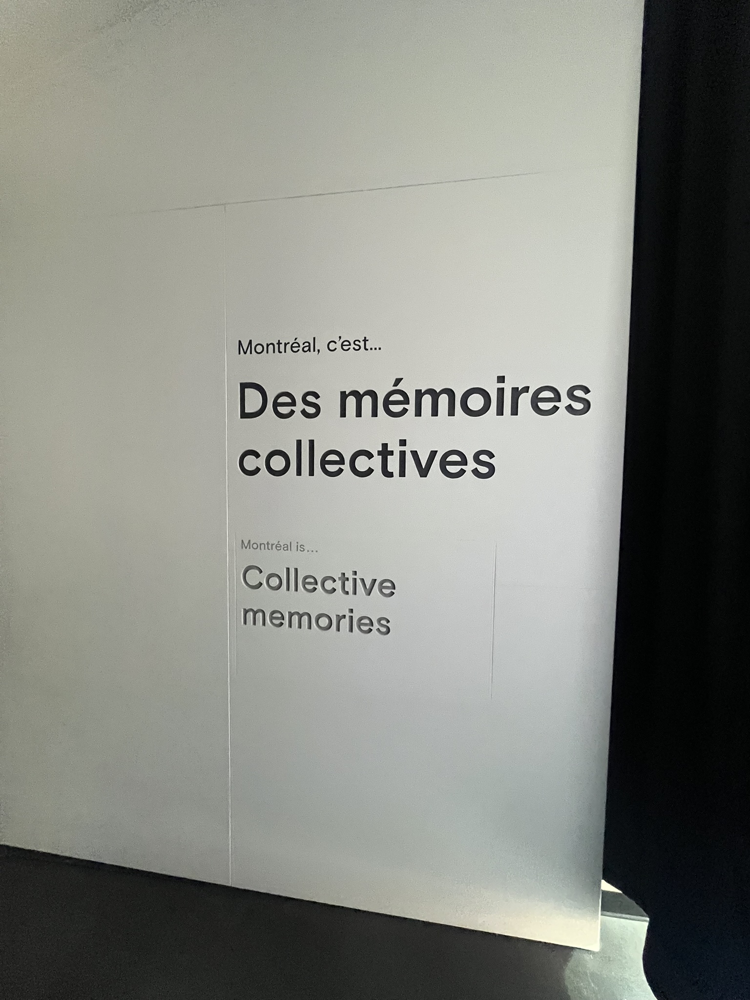
> La cartel pour l'expérience prise par Martin Parent (19 février 2026)
# Type d'installation: 
## Contemplative, immersive
 
> Vue de la salle de l'expérience prisent par Martin Parent (19 février 2026)
# Fonction du dispositif multimédia: 
## Scénographique, mise en valeur, mise en contexte, support pédagogique
# Mise en espace:
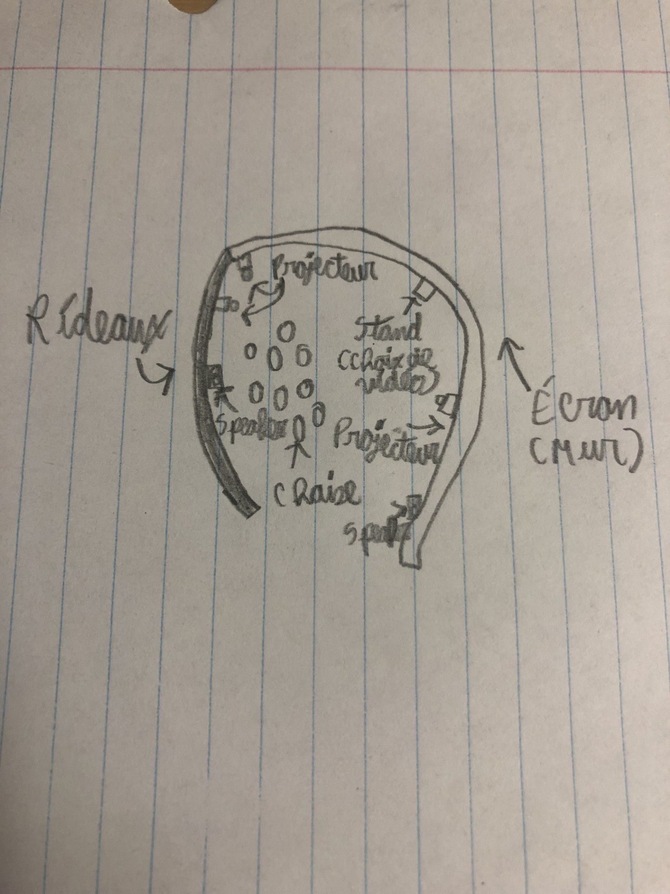
> Dessin avec information générale de la salle de l'expérience prise par Francis Parent (19 février 2026)
# Composantes et techniques: 
## Les vidéos, les tracks audios et plusieurs objets physiques seraient nécessaires pour la présentation. Les transports auraient un peu de difficulté pour les objets physiques et ne pas les endommager.
 
> Vue de la salle de l'expérience prisent par Martin Parent (19 février 2026)
# Éléments nécessaires: 
## Vidéos, speakers, écran, projecteurs, les objets attachés sur l'écran
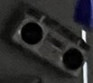 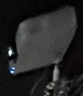 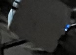 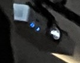 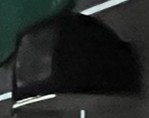
> Plusieurs composants nécessaires pour pouvoir vivre l'expérience prisent par Martin Parent (19 février 2026)
# Expérience vécue:
# Ce qui m'a plu: 
## La présentation était amusante et m'a intéresser plus dans l'histoire de l'évènement. Aussi, les différentes façons que certaines vidéos se sont présentées m'ont surpris en gardant mon attention pour attraper chaque détail.
# Aspects à ne pas retenir: 
## Plusieurs fois durant la présentation, les vidéos s'éparpillent partout sur le gros écran, ce qui fait difficile à garder attention.
# Références:
- https://memmtl.ca/programmation/montreal
- https://fr.wikipedia.org/wiki/Exposition_universelle_de_1967
- https://ville.montreal.qc.ca/memoiresdesmontrealais/memoires-dexpo-67
- https://www.expo67.museum/ressource/encyclopedie-du-mem-memoires-dexpo-67/
- https://www2.banq.qc.ca/histoire_quebec/parcours_thematiques/Expo67/peupler_la_terre/index_nations.jsp
- Le croquis a été pris par Francis Parent
- Toutes les autres photos sont prises par Martin Parent
